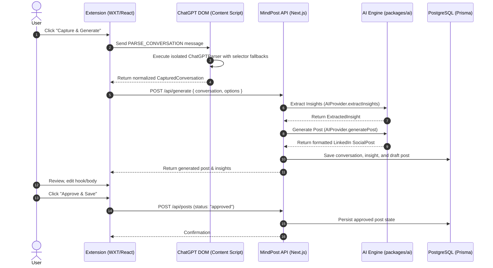

# MindPost - System Architecture

MindPost is an AI-powered browser extension and content platform that converts valuable AI problem-solving sessions into high-engagement social media posts.

## 1. High-Level Monorepo Overview

The codebase is organized as a strict pnpm workspace monorepo:

```
mindpost/
├── apps/
│   ├── extension/       # WXT + React + TypeScript + Tailwind CSS Browser Extension
│   ├── web/             # Next.js Web Dashboard for reviewing & managing saved posts
│   └── api/             # Next.js API Service (Route Handlers for AI, DB & Extension)
├── packages/
│   ├── shared/          # Canonical types, parser contracts, API interfaces, constants
│   ├── ai/              # AI Provider abstraction layer (OpenAI active, Gemini/Claude stubs)
│   ├── database/        # PostgreSQL Prisma schema, client singleton, repositories
│   └── config/          # Shared tsconfig bases, Tailwind presets
├── docs/                # Architecture, setup, and specification documentation
├── .env.example         # Documented environment variables
├── README.md
└── package.json
```

## 2. Phase 1 Data Flow



## 3. Core Isolation Principles

1. **DOM Parser Decoupling (Rule 9 & 10)**:
   - ChatGPT's DOM structure is completely isolated inside `apps/extension/src/parsers/chatgpt.parser.ts`.
   - The parser implements the generic `IChatParser` interface from `@mindpost/shared`.
   - No DOM classes, query selectors, or browser-specific structures leak into the AI layer, API layer, or database.

2. **AI Provider Isolation (Rule 7 & 11)**:
   - All AI interactions are abstracted behind the `IAIProvider` interface in `@mindpost/shared` and implemented in `packages/ai`.
   - In Phase 1, only the `OpenAIProvider` is active.
   - Provider instantiation is handled via `AIProviderFactory`, allowing seamless zero-churn addition of Gemini and Claude in Phase 2.

3. **Database Isolation (Rule 8)**:
   - All database access is encapsulated inside `packages/database`.
   - Repositories (`PostRepository`, `ConversationRepository`) expose domain-friendly methods and map raw Prisma entities to `@mindpost/shared` domain types.
